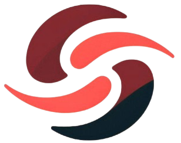

#   Sustenrace 

 

A Sustenrace é o resultado de uma parceria com a Mahindra, criada para enfrentar o desafio de popularizar a Fórmula E através de uma aplicação web inovadora. Nossa missão é unir educação e tecnologia, oferecendo uma experiência interativa e envolvente que conecta os usuários ao mundo dos carros da Fórmula E, promovendo inovação e novas formas de aprendizado.

Para concretizar esse objetivo, criamos uma plataforma interativa e educativa que conecta os entusiastas de automobilismo e corridas. O destaque da nossa solução são os modelos 3D gamificados dos carros, que oferecem uma experiência imersiva e divertida para os usuários.  Por meio desses carros, os usuários podem: 

* Explorar em detalhes o carro da Fórmula E, conhecendo as inovações tecnológicas, especificações das peças, e entendendo como essa categoria funciona como um verdadeiro laboratório para o desenvolvimento de tecnologias que podem impactar o mercado de consumo.
  
 

* Comparar os veículos da Fórmula E e Fórmula 1, examinando suas características específicas, semelhanças, diferenças e os aspectos positivos e negativos de cada um.
  
 

* Com base no conhecimento adquirido e na experiência com a plataforma, os usuários têm a chance de enviar ideias de melhorias e inovações para os carros da Fórmula E. Caso suas sugestões sejam escolhidas, eles podem ser recompensados financeiramente e, eventualmente, colaborar diretamente com as equipes de engenheiros e mecânicos na implementação dessas ideias, proporcionando uma oportunidade única para quem deseja atuar nessa área.

Além disso, para desmistificar o mito de que "sem o barulho do motor não há emoção", desenvolvemos um sistema de IoT integrado a uma pulseira, capaz de monitorar os batimentos cardíacos do público durante as corridas. Esses dados são transmitidos para o nosso site, onde são apresentados e analisados em tempo real, proporcionando uma nova dimensão de emoção e envolvimento. Para mais detalhes sobre esse sistema, acesse o repositório: <a href="https://github.com/brunacostaz/Sustenrace_Sensor_BPM">Sustenrace_Sensor_BPM 🔗</a>.

## Carro 3D

Para tornar essa experiência de gamificação possível, foram desenvolvidos três modelos 3D de carros utilizando o Blender, um software de modelagem tridimensional. Esses modelos foram exportados no formato GLTF e integrados a um código JavaScript, onde utilizamos a biblioteca Three.js. A Three.js é responsável por criar o ambiente visual, definir a iluminação e possibilitar uma visualização detalhada dos carros. 

Além disso, implementamos funcionalidades que permitem ao usuário explorar o carro por meio de botões, alterar sua cor e trocar entre os diferentes modelos. Também utilizamos a biblioteca auxiliar OrbitControls, da Three.js, para permitir que o usuário rotacione o carro em 360°, conforme sua preferência.

Nos próximos passos dessa gamificação, iremos utilizar o React Router para adicionar uma página dedicada a essa experiência interativa com os carros. Nessa página, além de explorar o modelo 3D da Fórmula E, o usuário poderá comparar o carro da Fórmula E com o da Fórmula 1. Isso será feito com dois modelos 3D lado a lado, acompanhados por menus explicativos sobre as principais diferenças e inovações de cada um. Por fim, disponibilizaremos um formulário onde os usuários poderão submeter suas ideias de melhoria diretamente para as equipes da Fórmula E.

## Tecnologias Utilizadas:

* `React.js`
* `React Router`
* `Chart.js`
* `Three.js`
* `JavaScript`
* `CSS3`

## Ferramentas Utilizadas:

* `Blender`
* `Figma`
* `Git` e `GitHub`

